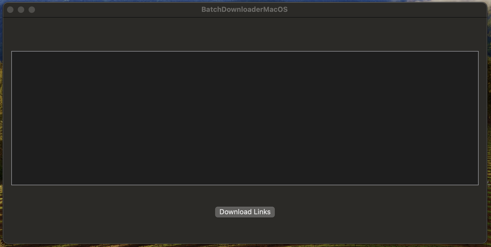
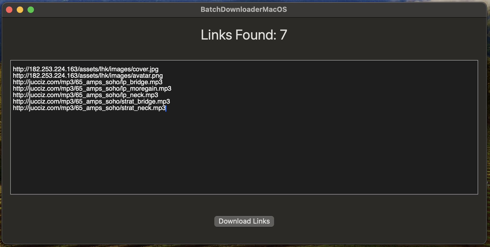
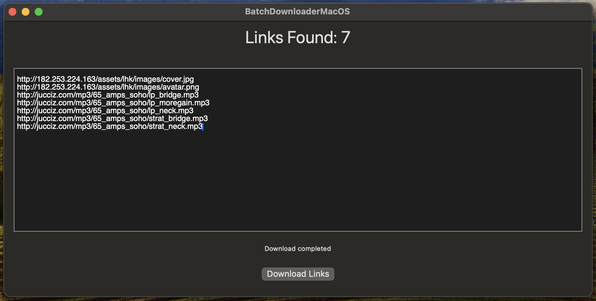

# 📱 MacOS Batch Downloader

This macos application allows you to download images/audio/video from a list of URLs provided in a text editor. The app displays the number of links found and shows the download status.

## 🚀 Features

- ✏️ **Text Editor**: Input your URLs into a text editor.
- 🔢 **Link Count**: Displays the number of links found in the text editor.
- 📥 **Download Images**: Downloads images from the URLs provided and saves them to a selected folder.
- 🕒 **Download Status**: Shows the current status of the download process.

## 🛠️ How to Use

1. **Enter URLs**: Copy and paste your image URLs into the text editor.
2. **Count Links**: The app will automatically count and display the number of valid links.
3. **Download**: Click the "Download Links" button to start downloading the images to your selected folder.
4. **Monitor Status**: The current download status will be shown at the bottom of the app.

## 📚 Requirements

- Swift 5.3 or later
- macOS 11.0 or later
- Xcode 12.0 or later

## 📸 Screenshots

## 🤝 Contributing

Contributions are welcome! Please feel free to submit a Pull Request.

## 📄 License

This project is licensed under the MIT License.

---

Happy coding! 😃
